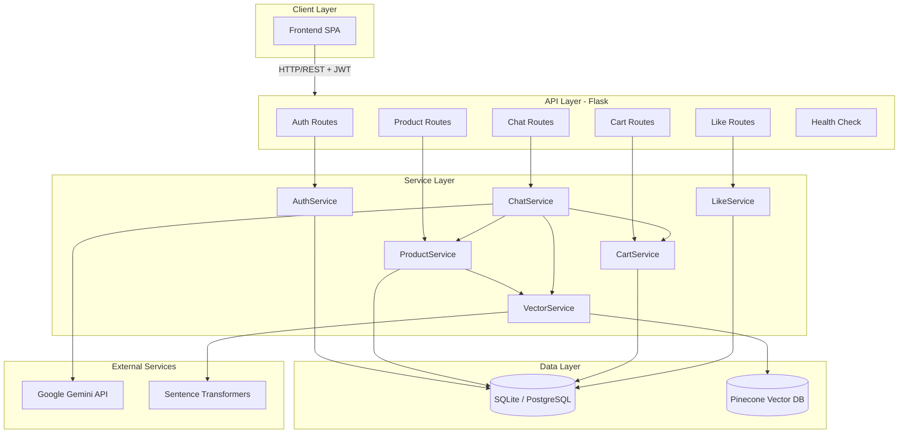
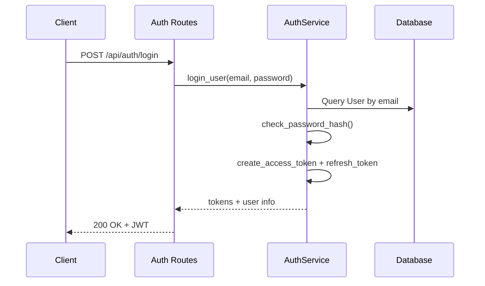
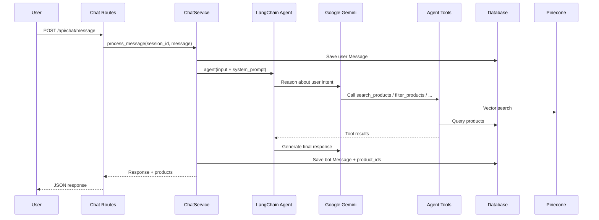

# High-Level Design (HLD)

## E-commerce + AI Chatbot Backend API

**Phiên bản:** 1.0  
**Ngày:** 15/07/2026  
**Dự án:** `sass_backend`

---

## 1. Tổng quan hệ thống

### 1.1 Mục đích

Hệ thống là **backend API** cho nền tảng thương mại điện tử tích hợp **chatbot AI tư vấn sản phẩm** (sơn dân dụng / kiến trúc). Backend cung cấp:

- Quản lý người dùng và xác thực JWT
- CRUD sản phẩm và tìm kiếm đa chiều
- Tìm kiếm ngữ nghĩa (semantic search) qua vector database
- Chatbot AI (Google Gemini + LangChain) với tool calling
- Giỏ hàng, yêu thích, gợi ý sản phẩm

### 1.2 Phạm vi

| Trong phạm vi | Ngoài phạm vi |
|---------------|---------------|
| REST API backend | Frontend UI |
| Xác thực JWT | Thanh toán / đơn hàng |
| Tìm kiếm vector (Pinecone) | Quản lý kho vận chuyển |
| Chatbot tư vấn sản phẩm | Admin dashboard |
| Giỏ hàng & likes | Email/SMS notification |

### 1.3 Stakeholders

| Vai trò | Mô tả |
|---------|-------|
| End User | Khách hàng tìm sản phẩm, chat tư vấn, mua hàng |
| Frontend App | SPA (React/Vue) gọi API qua HTTP |
| Admin | Quản lý sản phẩm qua API (JWT protected) |
| DevOps | Triển khai trên Render/similar với Gunicorn |

---

## 2. Kiến trúc tổng thể

### 2.1 Sơ đồ kiến trúc



### 2.2 Kiến trúc phân lớp (Layered Architecture)

```
┌─────────────────────────────────────────┐
│           Presentation Layer            │
│   Flask Blueprints (Routes/Controllers)   │
├─────────────────────────────────────────┤
│            Business Logic Layer         │
│   Services (Auth, Product, Chat, ...)   │
├─────────────────────────────────────────┤
│             Data Access Layer           │
│   SQLAlchemy Models + Pinecone Client   │
├─────────────────────────────────────────┤
│           External Integration          │
│   Gemini API, Sentence Transformers     │
└─────────────────────────────────────────┘
```

### 2.3 Nguyên tắc thiết kế

- **Separation of Concerns**: Routes chỉ xử lý HTTP; logic nghiệp vụ nằm trong Services
- **Lazy Initialization**: VectorService và ChatService khởi tạo khi cần (tránh load model nặng lúc startup)
- **Hybrid Search**: Kết hợp vector similarity (Pinecone) và SQL filter (truyền thống)
- **Stateless API**: JWT cho auth; session chat lưu DB + in-memory memory (LangChain)
- **Fail-soft**: Vector search lỗi → fallback sang SQL text search

---

## 3. Các module chính

### 3.1 Module Authentication

**Trách nhiệm:** Đăng ký, đăng nhập, refresh token, quản lý preferences.

| Thành phần | Mô tả |
|------------|-------|
| AuthService | Logic xác thực, hash password (Werkzeug) |
| auth_routes | REST endpoints `/api/auth/*` |
| Flask-JWT-Extended | Access token (1h) + Refresh token (30 ngày) |

**Luồng xác thực:**



### 3.2 Module Product & Search

**Trách nhiệm:** CRUD sản phẩm, lọc đa chiều, tìm kiếm ngữ nghĩa, gợi ý.

| Thành phần | Mô tả |
|------------|-------|
| ProductService | CRUD + search + recommendations |
| VectorService | Embedding + Pinecone upsert/query |
| Product Model | SQLAlchemy entity với indexes |

**Chiến lược tìm kiếm:**

1. **Semantic Search**: Query → embedding → Pinecone top-k → filter SQL → sort by score
2. **Traditional Filter**: category, brand, price range, rating, stock
3. **Fallback**: Nếu Pinecone không trả kết quả → `Product.search_by_filters()`

### 3.3 Module AI Chatbot

**Trách nhiệm:** Hội thoại tư vấn sản phẩm sơn, tool calling, lưu lịch sử.

| Thành phần | Mô tả |
|------------|-------|
| ChatService | LangChain agent + Gemini LLM |
| Tools | search_products, filter_products, get_product_details, get_recommendations, add_to_cart |
| Memory | ConversationBufferWindowMemory (k=10 messages) |
| Persistence | ChatSession + Message models |

**Luồng xử lý tin nhắn:**



### 3.4 Module Cart & Likes

| Module | Trách nhiệm |
|--------|-------------|
| CartService | Thêm/xóa/cập nhật giỏ hàng, tính tổng tiền |
| LikeService | Toggle like, popular products, user favorites |

Cả hai module yêu cầu JWT; user chỉ truy cập dữ liệu của chính mình.

---

## 4. Tích hợp bên ngoài

### 4.1 Google Gemini

| Thuộc tính | Giá trị |
|------------|---------|
| SDK | `langchain-google-genai` |
| Model | Cấu hình qua `GEMINI_MODEL` env |
| Temperature | 0.7 |
| Max tokens | 1000 |
| Vai trò | LLM chính cho chatbot agent |

### 4.2 Pinecone Vector Database

| Thuộc tính | Giá trị |
|------------|---------|
| Embedding Model | `all-MiniLM-L6-v2` (384 dimensions) |
| Index | `PINECONE_INDEX_NAME` (default: `ecommerce-products`) |
| Metadata | category, subcategory, brand, price, rating, in_stock |
| Operations | upsert, query, delete, batch_upsert |

### 4.3 Database (SQL)

| Môi trường | Engine |
|------------|--------|
| Development | SQLite (`sqlite:///ecommerce.db`) |
| Production | PostgreSQL (qua `DATABASE_URL`) |

ORM: **SQLAlchemy 2.x** + **Flask-Migrate (Alembic)**

---

## 5. Bảo mật

### 5.1 Xác thực & Phân quyền

| Cơ chế | Chi tiết |
|--------|----------|
| Password | Werkzeug `generate_password_hash` (bcrypt-based) |
| Access Token | JWT, expires 3600s (configurable) |
| Refresh Token | JWT, expires 30 ngày |
| Protected Routes | `@jwt_required()` decorator |
| Ownership Check | Cart/Likes/Chat history kiểm tra `user_id == jwt_identity` |

### 5.2 CORS

- Cho phép tất cả origins (`*`) với `supports_credentials=True`
- Frontend URL mặc định: `http://localhost:5173`

### 5.3 Error Handling

- Global handlers: 400, 404, 500
- JWT handlers: expired, invalid, missing token → 401
- Không expose stack trace ra client (production)

---

## 6. Triển khai & Vận hành

### 6.1 Môi trường

| Biến môi trường | Mô tả |
|-----------------|-------|
| `FLASK_ENV` | development / production |
| `DATABASE_URL` | Connection string DB |
| `JWT_SECRET_KEY` | Secret cho JWT |
| `GOOGLE_API_KEY` | Gemini API key |
| `GEMINI_MODEL` | Tên model Gemini |
| `PINECONE_API_KEY` | Pinecone API key |
| `PINECONE_INDEX_NAME` | Tên index vector |
| `PORT` | Port server (default 5000) |

### 6.2 Deployment

```
Development:  python -m flask run --debug
Production:   gunicorn -c gunicorn.conf.py "app:app"
```

**Gunicorn config:**
- 1 worker (memory constraints do ML models)
- Sync worker class
- Timeout 30s
- Preload app enabled

### 6.3 Logging & Monitoring

- Rotating file log: `logs/ecommerce_chatbot.log` (10MB, 10 backups)
- Console + file output
- Health endpoints: `/api/health`, `/api/chat/health`

### 6.4 Khởi tạo dữ liệu

1. `flask db upgrade` — chạy migrations
2. `python -m scripts.index_all_products` — index embeddings lên Pinecone
3. Auto-seed products lần đầu request (via `before_request` hook)

---

## 7. Cấu trúc thư mục

```
sass_backend/
├── app.py                  # Flask app factory
├── config.py               # Environment config
├── xxx.py                  # SQLAlchemy db instance
├── routes/                 # API blueprints
│   ├── auth_routes.py
│   ├── product_routes.py
│   ├── chat_routes.py
│   ├── cart_routes.py
│   └── like_routes.py
├── services/               # Business logic
│   ├── auth_service.py
│   ├── product_service.py
│   ├── vector_service.py
│   ├── chat_service.py
│   ├── cart_service.py
│   └── like_service.py
├── models/                 # SQLAlchemy models
├── migrations/             # Alembic migrations
├── scripts/                # Utility scripts
├── utils/                  # Logger, seeder
├── docs/                   # Design documents
└── logs/                   # Application logs
```

---

## 8. API Surface (Tóm tắt)

| Nhóm | Prefix | Số endpoints | Auth |
|------|--------|--------------|------|
| Auth | `/api/auth` | 6 | Mixed |
| Products | `/api/products` | 10 | Mixed |
| Cart | `/api/cart` | 5 | JWT required |
| Likes | `/api/likes` | 5 | Mixed |
| Chat | `/api/chat` | 6 | Optional JWT |
| System | `/api/health` | 1 | Public |

---

## 9. Ràng buộc & Giả định

### Ràng buộc kỹ thuật

- Python 3.12+
- Memory: Sentence Transformer + LangChain agent tiêu tốn RAM đáng kể
- Pinecone và Gemini yêu cầu kết nối internet
- Single worker Gunicorn do memory constraints

### Giả định

- Frontend gửi JWT qua `Authorization: Bearer <token>`
- Mỗi product có `embedding_id` tương ứng với vector trên Pinecone
- Chat session có thể anonymous (không bắt buộc login)
- Admin endpoints (CRUD product) chỉ cần JWT, chưa có role-based access control

---

## 10. Roadmap mở rộng (Đề xuất)

| Ưu tiên | Tính năng |
|---------|-----------|
| Cao | Role-based access control (admin vs user) |
| Cao | Order management / checkout flow |
| Trung bình | Redis cache cho session memory |
| Trung bình | Rate limiting cho chat API |
| Thấp | WebSocket cho real-time chat |
| Thấp | Multi-language support |
