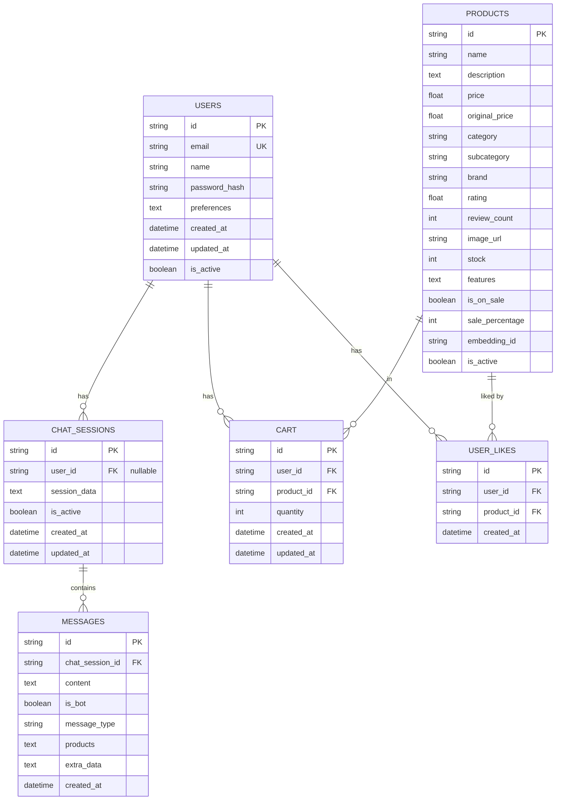
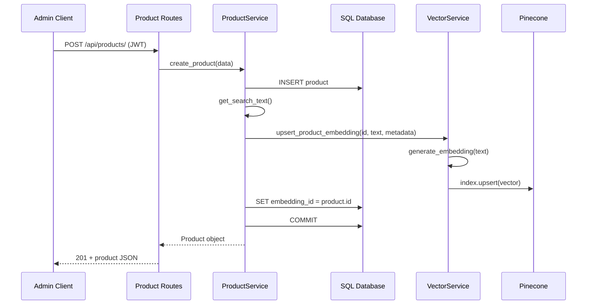
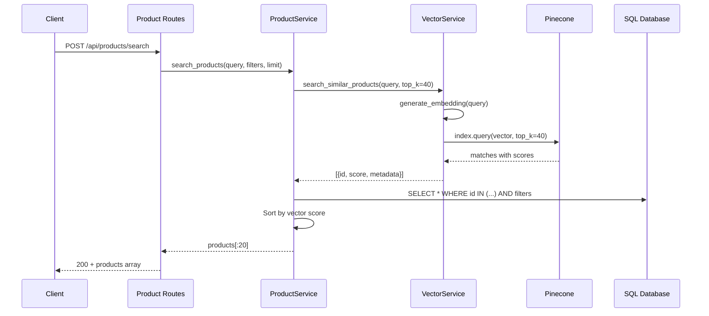
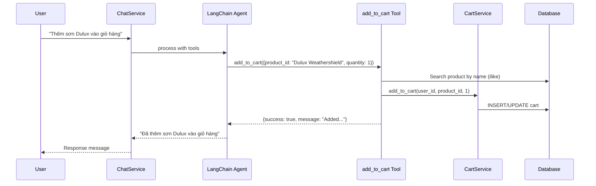
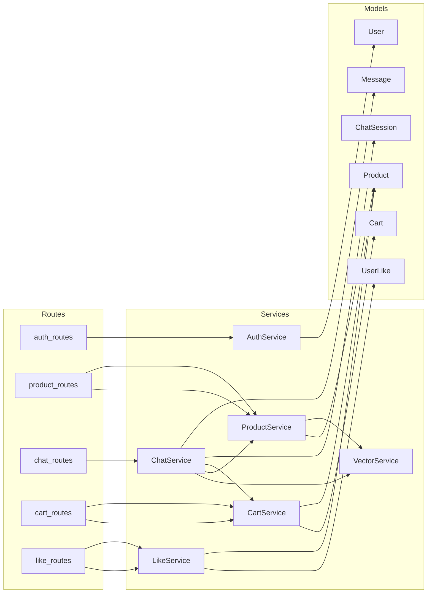

# Low-Level Design (LLD)

## E-commerce + AI Chatbot Backend API

**Phiên bản:** 1.0  
**Ngày:** 15/07/2026  
**Dự án:** `sass_backend`

---

## 1. Application Bootstrap

### 1.1 App Factory (`app.py`)

```python
def create_app(config_name=None):
    app = Flask(__name__)
    app.config.from_object(config[config_name])
    db.init_app(app)
    jwt.init_app(app)
    migrate.init_app(app, db)
    CORS(app)
    setup_logging(app)
    register_routes(app)
    # Error handlers + JWT handlers
    # before_request: db.create_all() + seed products (one-time)
    return app
```

**Khởi tạo một lần (first request):**
1. `db.create_all()` — tạo tables nếu chưa có
2. `DatabaseSeeder.seed_products()` — seed dữ liệu mẫu
3. Hook tự remove sau lần chạy đầu

### 1.2 Configuration (`config.py`)

| Key | Default | Mô tả |
|-----|---------|-------|
| `SECRET_KEY` | `dev-secret-key-...` | Flask secret |
| `SQLALCHEMY_DATABASE_URI` | `sqlite:///ecommerce.db` | DB connection |
| `JWT_SECRET_KEY` | `jwt-secret-key-...` | JWT signing key |
| `JWT_ACCESS_TOKEN_EXPIRES` | 3600s | Access token TTL |
| `JWT_REFRESH_TOKEN_EXPIRES` | 30 days | Refresh token TTL |
| `GOOGLE_API_KEY` | env | Gemini API key |
| `GEMINI_MODEL` | env | Model name |
| `PINECONE_API_KEY` | env | Pinecone key |
| `PINECONE_INDEX_NAME` | `ecommerce-products` | Vector index |
| `EMBEDDING_MODEL` | `all-MiniLM-L6-v2` | Sentence Transformer |
| `EMBEDDING_DIMENSION` | 384 | Vector dimension |
| `FRONTEND_URL` | `http://localhost:5173` | CORS reference |

---

## 2. Database Schema

### 2.1 Entity Relationship Diagram



### 2.2 Chi tiết bảng

#### `users`

| Column | Type | Constraints | Index |
|--------|------|-------------|-------|
| id | VARCHAR(36) | PK | — |
| email | VARCHAR(120) | NOT NULL, UNIQUE | Yes |
| name | VARCHAR(100) | NOT NULL | — |
| password_hash | VARCHAR(255) | NOT NULL | — |
| preferences | TEXT | JSON string | — |
| created_at | DATETIME | — | — |
| updated_at | DATETIME | — | — |
| is_active | BOOLEAN | default True | — |

**Default preferences JSON:**
```json
{
  "favoriteCategories": [],
  "priceRange": [0, 2000],
  "favoriteBrands": []
}
```

#### `products`

| Column | Type | Constraints | Index |
|--------|------|-------------|-------|
| id | VARCHAR(36) | PK | — |
| name | VARCHAR(200) | NOT NULL | Yes |
| description | TEXT | NOT NULL | — |
| price | FLOAT | NOT NULL | Yes |
| original_price | FLOAT | nullable | — |
| category | VARCHAR(100) | NOT NULL | Yes |
| subcategory | VARCHAR(100) | NOT NULL | Yes |
| brand | VARCHAR(100) | NOT NULL | Yes |
| rating | FLOAT | default 0.0 | Yes |
| review_count | INT | default 0 | — |
| image_url | VARCHAR(500) | nullable | — |
| stock | INT | default 0 | Yes |
| features | TEXT | JSON array | — |
| is_on_sale | BOOLEAN | default False | Yes |
| sale_percentage | INT | nullable | — |
| embedding_id | VARCHAR(100) | nullable | — |
| is_active | BOOLEAN | default True | Yes |

#### `cart`

| Column | Type | Constraints |
|--------|------|-------------|
| id | VARCHAR(36) | PK |
| user_id | VARCHAR(36) | FK → users.id, NOT NULL |
| product_id | VARCHAR(36) | FK → products.id, NOT NULL |
| quantity | INT | NOT NULL, default 1 |

#### `user_likes`

| Column | Type | Constraints |
|--------|------|-------------|
| id | VARCHAR(36) | PK |
| user_id | VARCHAR(36) | FK → users.id, NOT NULL |
| product_id | VARCHAR(36) | FK → products.id, NOT NULL |
| — | — | UNIQUE(user_id, product_id) |

#### `chat_sessions`

| Column | Type | Constraints |
|--------|------|-------------|
| id | VARCHAR(36) | PK |
| user_id | VARCHAR(36) | FK → users.id, nullable |
| session_data | TEXT | JSON string |
| is_active | BOOLEAN | default True |

#### `messages`

| Column | Type | Constraints |
|--------|------|-------------|
| id | VARCHAR(36) | PK |
| chat_session_id | VARCHAR(36) | FK → chat_sessions.id, NOT NULL |
| content | TEXT | NOT NULL |
| is_bot | BOOLEAN | default False |
| message_type | VARCHAR(50) | default "text" |
| products | TEXT | JSON array of product IDs |
| extra_data | TEXT | JSON object |

---

## 3. API Endpoints — Chi tiết

### 3.1 Authentication (`/api/auth`)

#### `POST /api/auth/register`

**Request:**
```json
{
  "name": "Nguyen Van A",
  "email": "user@example.com",
  "password": "password123"
}
```

**Validation:**
- Required: `name`, `email`, `password`
- Password min length: 6

**Response (201):**
```json
{
  "success": true,
  "message": "User registered successfully",
  "user": { "id": "...", "email": "...", "name": "...", "preferences": {} },
  "access_token": "eyJ...",
  "refresh_token": "eyJ..."
}
```

**Logic flow:**
1. Check email uniqueness → 400 if exists
2. Generate UUID for user id
3. Hash password via `User.set_password()`
4. Save to DB
5. Generate JWT access + refresh tokens

---

#### `POST /api/auth/login`

**Request:**
```json
{ "email": "user@example.com", "password": "password123" }
```

**Response (200):** Same structure as register.

**Error cases:**
- Invalid credentials → 401
- Account deactivated → 401

---

#### `POST /api/auth/refresh`

**Headers:** `Authorization: Bearer <refresh_token>`

**Response (200):**
```json
{ "success": true, "access_token": "eyJ..." }
```

---

#### `GET /api/auth/me`

**Headers:** `Authorization: Bearer <access_token>`

**Response (200):**
```json
{ "success": true, "user": { ... } }
```

---

#### `PUT /api/auth/preferences`

**Request:**
```json
{
  "favoriteCategories": ["Sơn nội thất"],
  "priceRange": [100, 500],
  "favoriteBrands": ["Dulux", "Jotun"]
}
```

---

#### `POST /api/auth/deactivate`

Soft-delete: sets `is_active = False`.

---

### 3.2 Products (`/api/products`)

#### `GET /api/products/`

**Query Parameters:**

| Param | Type | Mô tả |
|-------|------|-------|
| category | string | Lọc theo category |
| subcategory | string | Lọc theo subcategory |
| brand | string | Lọc theo brand |
| min_price | float | Giá tối thiểu |
| max_price | float | Giá tối đa |
| min_rating | float | Rating tối thiểu |
| in_stock_only | bool | Chỉ sản phẩm còn hàng |
| search | string | Từ khóa tìm kiếm (kích hoạt semantic search) |
| limit | int | Số kết quả (default 50) |

**Logic:**
- Nếu có `search` → `ProductService.search_products()` (vector + filter)
- Không có `search` → `Product.search_by_filters()` (SQL only)

---

#### `POST /api/products/search`

**Request:**
```json
{
  "query": "sơn chống thấm ngoài trời",
  "filters": {
    "category": "Sơn kiến trúc",
    "min_price": 100,
    "max_price": 500
  },
  "limit": 20
}
```

---

#### `GET /api/products/recommendations`

**Query Parameters:**
- `product_id` (optional) — gợi ý tương tự sản phẩm này
- `limit` (default 6)

**Logic priority:**
1. Nếu có `product_id` → vector search similar products
2. Nếu user đã login → dùng preferences làm query vector
3. Fallback → top rated products

---

#### `POST /api/products/` (Admin — JWT required)

**Required fields:** `name`, `description`, `price`, `category`, `subcategory`, `brand`

**Side effects:**
1. Insert product vào DB
2. Generate embedding từ `product.get_search_text()`
3. Upsert vector lên Pinecone
4. Set `embedding_id = product.id`

---

### 3.3 Chat (`/api/chat`)

#### `POST /api/chat/message`

**Request:**
```json
{
  "message": "Tôi muốn sơn phòng khách màu sáng",
  "session_id": "optional-uuid"
}
```

**Response (200):**
```json
{
  "success": true,
  "session_id": "uuid",
  "response": {
    "id": "msg-uuid",
    "content": "Dựa trên nhu cầu của bạn...",
    "isBot": true,
    "timestamp": "2026-07-15T09:00:00",
    "products": [{ "id": "...", "name": "...", "price": 299.99 }],
    "type": "product"
  }
}
```

**Chi tiết `process_message()` flow:**

```
1. Initialize ChatService (if not done)
2. Get or create ChatSession in DB
3. Save user Message to DB
4. Get/create ConversationBufferWindowMemory (k=10)
5. Create LangChain tools (5 tools)
6. Initialize CONVERSATIONAL_REACT_DESCRIPTION agent
7. Inject system prompt (Vietnamese paint consultant)
8. agent.invoke({ input: system_prompt + user_message })
9. Extract product_ids from intermediate_steps
10. Fallback: parse JSON from response / match product names in text
11. Save bot Message with product_ids
12. Return response with full product objects
```

---

#### Agent Tools Specification

| Tool | Input | Output | Service Used |
|------|-------|--------|--------------|
| `search_products` | query: string | JSON `{message, product_ids}` | VectorService |
| `filter_products` | filter_json: string | JSON `{message, product_ids}` | Product.search_by_filters |
| `get_product_details` | product_id: string | Text product details | Product.query |
| `get_recommendations` | product_id or text | Text recommendations | VectorService |
| `add_to_cart` | JSON `{product_id, quantity, user_id}` | JSON result | CartService |

---

#### `GET /api/chat/history/<session_id>`

**Query:** `limit` (default 50)

**Authorization:** Nếu session có `user_id`, phải match JWT identity.

**Response:** Messages với `include_product_details=True`.

---

#### `GET /api/chat/health`

**Response:**
```json
{
  "success": true,
  "status": "healthy",
  "services": {
    "chat_service": "initialized",
    "vector_service": "initialized",
    "llm": "connected"
  },
  "vector_stats": { "total_vector_count": 150, ... }
}
```

---

### 3.4 Cart (`/api/cart`)

Tất cả endpoints yêu cầu JWT. Kiểm tra `current_user == user_id`.

#### `GET /api/cart/<user_id>`

**Response:** Array of cart items với nested `product` object.

#### `POST /api/cart/add`

**Request:**
```json
{ "user_id": "uuid", "product_id": "uuid", "quantity": 2 }
```

**Logic:**
- Nếu item đã tồn tại → `quantity += quantity`
- Nếu chưa → tạo Cart record mới

#### `DELETE /api/cart/remove`

**Request:** `{ "user_id": "uuid", "item_id": "cart-item-uuid" }`

#### `PUT /api/cart/update`

**Request:** `{ "user_id": "uuid", "item_id": "uuid", "quantity": 3 }`

- `quantity <= 0` → remove item

#### `DELETE /api/cart/clear`

**Request:** `{ "user_id": "uuid" }`

---

### 3.5 Likes (`/api/likes`)

#### `POST /api/likes/toggle`

**Request:** `{ "product_id": "uuid" }`

**Response:**
```json
{ "success": true, "is_liked": true, "message": "Product liked" }
```

#### `GET /api/likes/popular`

**Query:** `limit` (default 10)

**Logic:** `GROUP BY product_id ORDER BY COUNT DESC`

---

## 4. Service Layer — Chi tiết

### 4.1 VectorService

```python
class VectorService:
    def __init__(self):
        self.model = None      # SentenceTransformer
        self.index = None      # Pinecone Index
        self.initialized = False

    def initialize(self):
        self.pc = Pinecone(api_key=...)
        self.index = self.pc.Index(index_name)
        self.model = SentenceTransformer("all-MiniLM-L6-v2")

    def generate_embedding(self, text: str) -> List[float]:
        return self.model.encode(text).tolist()

    def upsert_product_embedding(self, product_id, text, metadata):
        embedding = self.generate_embedding(text)
        self.index.upsert([{"id": product_id, "values": embedding, "metadata": metadata}])

    def search_similar_products(self, query_text, top_k=10, filter_dict=None):
        query_embedding = self.generate_embedding(query_text)
        results = self.index.query(vector=query_embedding, top_k=top_k, include_metadata=True)
        return [{"id": m["id"], "score": m["score"], "metadata": m["metadata"]} for m in results["matches"]]

    def batch_upsert_products(self, products, batch_size=100):
        # Generate embeddings, upsert in batches of 100
```

**Embedding text format** (`Product.get_search_text()`):
```
"{name} {description} {brand} {category} {subcategory} {features_joined}"
```

**Pinecone metadata schema:**
```json
{
  "category": "Sơn nội thất",
  "subcategory": "Sơn bóng",
  "brand": "Dulux",
  "price": 299.99,
  "rating": 4.5,
  "in_stock": true
}
```

---

### 4.2 ProductService

#### `search_products(query, filters, limit)`

```
Algorithm:
1. vector_results = VectorService.search_similar_products(query, top_k=limit*2)
2. IF vector_results is empty:
     RETURN Product.search_by_filters(search_query=query, limit=limit)
3. product_ids = [r["id"] for r in vector_results]
4. query_builder = Product.query.filter(Product.id.in_(product_ids))
5. Apply SQL filters (category, brand, price, rating, stock)
6. Sort by vector score (descending)
7. RETURN products[:limit]
```

#### `get_recommendations(product_id, user_preferences, limit)`

```
IF product_id:
    search_text = product.get_search_text()
    similar = vector_search(search_text, top_k=limit+1)
    exclude self
ELIF user_preferences:
    pref_text = build from favoriteCategories + favoriteBrands + priceRange hints
    similar = vector_search(pref_text, top_k=limit)
ELSE:
    RETURN top rated active products
```

#### `create_product(data)`

```
1. product = Product(**data)
2. db.session.add(product) + flush
3. search_text = product.get_search_text()
4. VectorService.upsert_product_embedding(product.id, search_text, metadata)
5. product.embedding_id = product.id
6. db.session.commit()
```

---

### 4.3 ChatService

#### Memory Management

```python
self.memory_sessions: Dict[str, ConversationBufferWindowMemory] = {}

def get_or_create_memory(session_id):
    if session_id not in self.memory_sessions:
        self.memory_sessions[session_id] = ConversationBufferWindowMemory(
            k=10,                    # Keep last 10 message pairs
            return_messages=True,
            memory_key="chat_history"
        )
    return self.memory_sessions[session_id]
```

**Lưu ý:** Memory chỉ tồn tại in-process. Restart server → mất memory (DB history vẫn còn).

#### System Prompt

Chatbot được cấu hình là **Tư vấn bán hàng sơn** với các khả năng:
- Tư vấn loại sơn (dân dụng, kiến trúc, chống thấm, lót, trang trí)
- So sánh sản phẩm (Dulux vs Jotun, bóng vs mờ)
- Tư vấn hệ sơn (bả, lót, số lớp)
- Gợi ý màu sắc theo phong cách
- Tính toán lượng sơn
- Báo giá từ dữ liệu sản phẩm

#### Product ID Extraction (3 strategies)

1. **From intermediate_steps:** Parse `product_ids` từ tool outputs (`search_products`, `filter_products`)
2. **From JSON response:** Parse `product_ids` từ AI response nếu là JSON
3. **From text matching:** `_extract_product_names_from_text()` — match product names trong response text

---

### 4.4 AuthService

Tất cả methods là `@staticmethod`. Không giữ state.

| Method | Input | Output |
|--------|-------|--------|
| `register_user` | name, email, password | `{success, user, tokens}` |
| `login_user` | email, password | `{success, user, tokens}` |
| `get_user_by_id` | user_id | `User` or None |
| `update_user_preferences` | user_id, preferences dict | `{success, user}` |
| `refresh_token` | current_user_id | `{success, access_token}` |
| `deactivate_user` | user_id | `{success, message}` |

---

### 4.5 CartService

| Method | Logic |
|--------|-------|
| `add_to_cart` | Upsert: existing item → increment quantity; new → create |
| `get_cart` | Join cart items với Product.to_dict() |
| `remove_from_cart` | Delete by item_id + user_id |
| `update_cart_quantity` | quantity <= 0 → remove; else update |
| `clear_cart` | Delete all items for user |
| `get_cart_total` | Sum(price * quantity) |

---

### 4.6 LikeService

| Method | Logic |
|--------|-------|
| `toggle_like` | Exists → delete (unlike); Not exists → create (like) |
| `get_user_likes` | Join với Product details |
| `is_liked_by_user` | Boolean check |
| `get_product_likes_count` | COUNT query |
| `get_popular_products` | GROUP BY + ORDER BY COUNT DESC |

---

## 5. Response Format Convention

### Success Response

```json
{
  "success": true,
  "message": "Optional message",
  "data": { ... }
}
```

### Error Response

```json
{
  "success": false,
  "message": "Error description"
}
```

### HTTP Status Codes

| Code | Usage |
|------|-------|
| 200 | Success |
| 201 | Created (register, create product) |
| 400 | Bad request / validation error |
| 401 | Unauthorized / invalid token |
| 403 | Forbidden (ownership check failed) |
| 404 | Resource not found |
| 500 | Internal server error |

---

## 6. Sequence Diagrams

### 6.1 Product Creation with Vector Indexing



### 6.2 Semantic Search Flow



### 6.3 Add to Cart via Chatbot



---

## 7. Error Handling Strategy

### 7.1 Route Level

```python
try:
    # business logic
    return jsonify(result), 200
except Exception as e:
    logger.error(f"Error in endpoint: {str(e)}")
    return jsonify({"success": False, "message": "..."}), 500
```

### 7.2 Service Level

- Database operations: `db.session.rollback()` on exception
- VectorService search: return `[]` on failure (fail-soft)
- ChatService: save error message to DB, return friendly response

### 7.3 Chat Error Fallback

```python
except Exception as e:
    error_msg = Message(content="I'm sorry, I encountered an error. Please try again.", is_bot=True)
    db.session.add(error_msg)
    db.session.commit()
    return { "content": error_msg.content, "products": [], "type": "text" }
```

---

## 8. Logging

### Configuration (`utils/logger_config.py`)

| Setting | Value |
|---------|-------|
| File | `logs/ecommerce_chatbot.log` |
| Max size | 10MB |
| Backups | 10 |
| Format | `%(asctime)s %(levelname)s %(name)s: %(message)s` |
| Handlers | RotatingFileHandler + StreamHandler |

### Logged Modules

- `services.chat_service`
- `services.vector_service`
- `services.product_service`
- `services.auth_service`
- `routes.auth_routes`
- `routes.product_routes`
- `routes.chat_routes`

### Suppressed Loggers

- `werkzeug` → WARNING
- `urllib3` → WARNING

---

## 9. Scripts & Utilities

### 9.1 `scripts/index_all_products.py`

Batch index tất cả active products lên Pinecone:

```
1. create_app() + app_context
2. VectorService.initialize()
3. Query all active products
4. Build batch: {id, text: get_search_text(), metadata}
5. VectorService.batch_upsert_products(batch)
```

**Usage:** `python -m scripts.index_all_products`

### 9.2 `utils/database_seeder.py`

Seed sample products khi app khởi động lần đầu (via `before_request` hook).

---

## 10. Dependencies Graph



---

## 11. Known Limitations

| # | Limitation | Impact | Workaround |
|---|------------|--------|------------|
| 1 | Chat memory in-process only | Mất context khi restart | Reload từ DB messages (chưa implement) |
| 2 | No RBAC for admin endpoints | Bất kỳ user JWT nào cũng CRUD product | Thêm role field + decorator |
| 3 | Cart routes return type mismatch | Service returns dict, route expects object | Cần align interface |
| 4 | `xxx.py` naming | Confusing module name | Rename to `extensions.py` |
| 5 | Single Gunicorn worker | Low throughput | Scale horizontally với load balancer |
| 6 | No rate limiting | API abuse risk | Thêm Flask-Limiter |
| 7 | CORS `*` | Security concern in production | Restrict to FRONTEND_URL |

---

## 12. Testing Checklist

| Area | Test Case |
|------|-----------|
| Auth | Register → Login → Refresh → Me → Deactivate |
| Products | List → Filter → Semantic search → CRUD |
| Chat | Send message → Get history → Clear session |
| Cart | Add → Update qty → Remove → Clear |
| Likes | Toggle → Check → Popular → User likes |
| Vector | Index products → Search → Verify scores |
| Health | `/api/health` + `/api/chat/health` |
